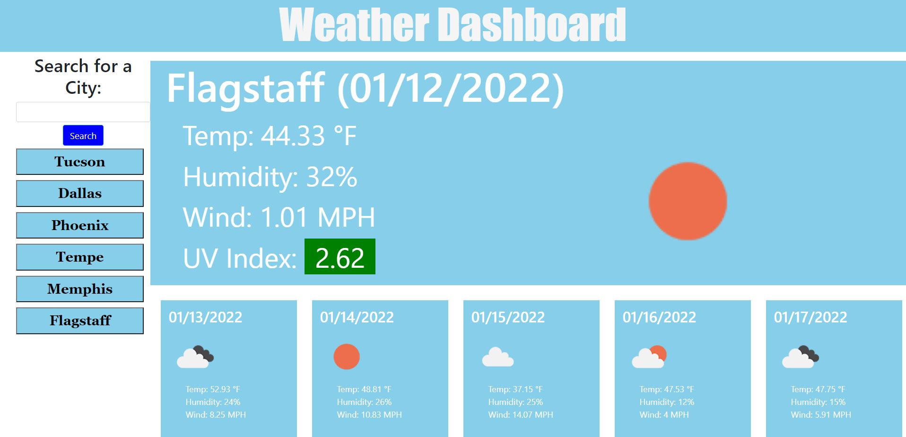

# Weather Dashboard
  

## Description

Displays current weather and 5 day forecase for cities chosen by the user.

## Table of Contents
* [Installation](#installation)
* [Usage](#usage)
* [License](#license)
* [Contributing](#contributing)
* [Questions](#questions)
   

## Installation

This webpage can be accessed at https://bslindsa.github.io/weather-dashboard/

## Usage

After accessing the webpage, the user will enter the city they want to access in the searchbar, then click on the search button. The current weather and 5 day forecast will be displayed on the screen. Each city searched will be remembered and listed on the left of the page. For quick reference to recently searched cities, the user will click on the button labeled as the city that the user wants to view, and the cities weather information will be displayed.

The following image demonstrates the application appearance:

https://bslindsa.github.io/basic-coding-quiz/

## License

This project is licensed under the Apache 2.0 license.

## Contributing

Open source

## Questions

Github Username: bslindsa 

Email: bslindsa@gmail.com

